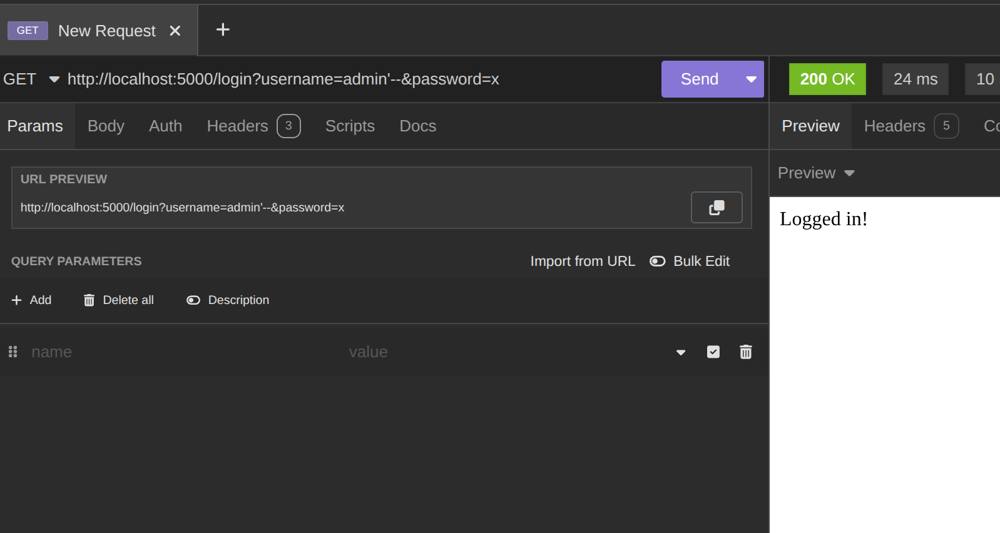
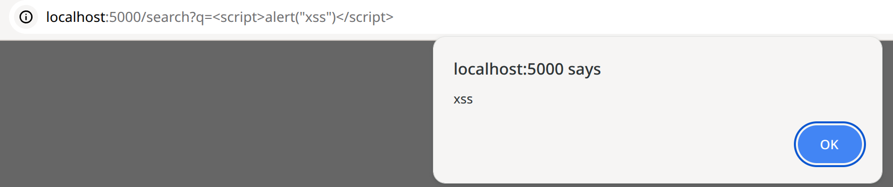

# AppSec Vulnerable Web App

A deliberately vulnerable web application created to demonstrate common web security vulnerabilities.

## Tech Stack

- Python
- Flask
- SQLite

---

# Vulnerability: SQL Injection

SQL Injection happens when user input is inserted directly into a SQL query without proper validation or parameterization.

In this application the query is built like this:

```python
query = f"SELECT * FROM users WHERE username='{username}' AND password='{password}'"
```

Because the input is concatenated directly into the query, an attacker can manipulate the SQL statement.

---

# Exploit

Authentication can be bypassed using the following payload:

```
http://localhost:5000/login?username=admin'--&password=x
```

The `--` comments out the rest of the SQL query, allowing login without knowing the password.

---

# Result



The attacker successfully bypasses authentication.

---

# Solution

SQL Injection can be prevented by using **parameterized queries**.

Example:

```python
query = "SELECT * FROM users WHERE username=? AND password=?"
cursor.execute(query, (username, password))
```

Parameterized queries ensure that user input is treated as data instead of executable SQL.

---

# Disclaimer

This project is intentionally vulnerable and created for educational purposes only.
Do not deploy this application in production.

---

# Vulnerability: Cross-Site Scripting (XSS)

Cross-Site Scripting (XSS) occurs when an application renders user input in the browser without proper sanitization.

In this endpoint the application directly returns user input to the page.

```python
return f"Results for: {query}"
```

Because the input is not escaped, an attacker can inject JavaScript that will execute in the victim's browser.

---

# Exploit

```
http://localhost:5000/search?q=<script>alert("xss")</script>
```

---

# Result



The injected JavaScript executes in the browser.

---

# Solution

User input must be escaped before being rendered in HTML.

Example:

```python
from markupsafe import escape

return f"Results for: {escape(query)}"
```

Escaping ensures that user input is treated as text instead of executable code.